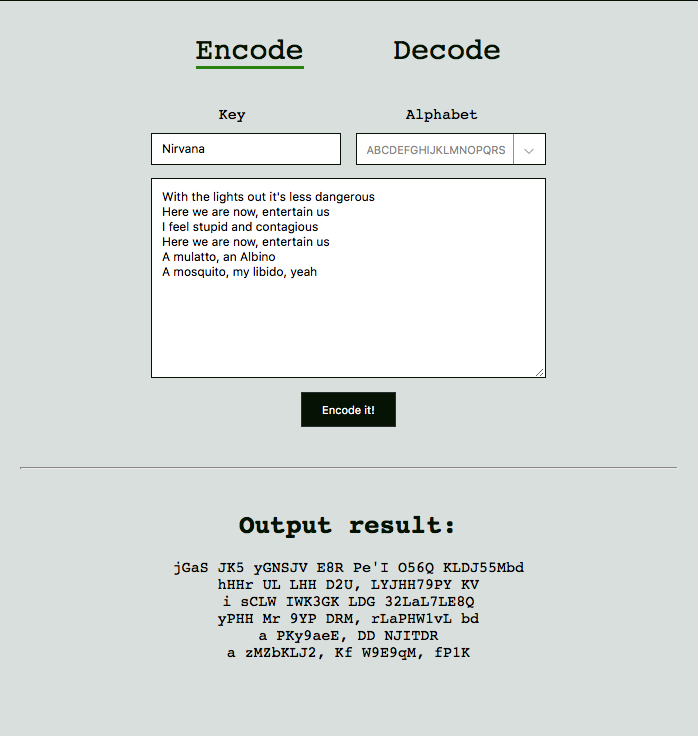

## A simple Vigenere Cipher encoder/decoder

The Vigenère cipher is a method of encrypting alphabetic text by using a series of interwoven Caesar ciphers based on the letters of a keyword. It is a form of polyalphabetic substitution. You can learn more about it on [Wikipedia](https://en.wikipedia.org/wiki/Vigenère_cipher).

This simple web app was made "just for fun", but unlike most of things that I do "just for fun" this one actually works (or, at least, appears to be working).

### Here is a few examples of how does it work

